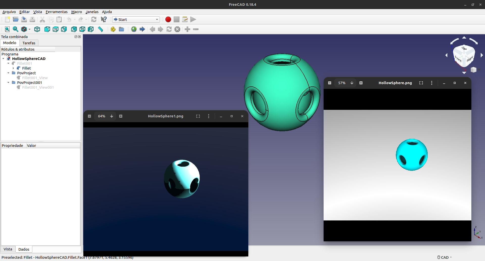
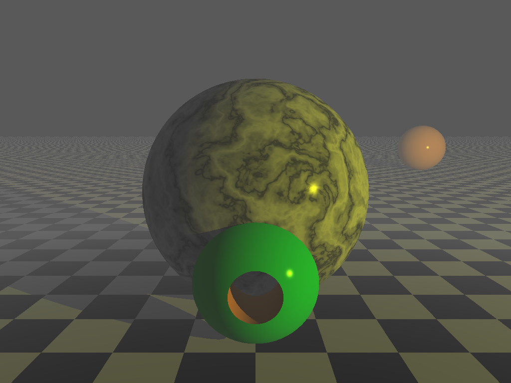

# RayTracing-The_Beginning
In this repo you see my start of <b>study</b> and <b>experimentations</b> with ray tracing :sunny:

## Tools
* POV-Ray - [see more](https://github.com/POV-Ray/povray "Povray's Github Project")
* FreeCAD - [see more](https://www.freecadweb.org/ "FreeCAD's Homepage")

## Works
### Hollow Sphere

### Hollow And Mesh Spheres
